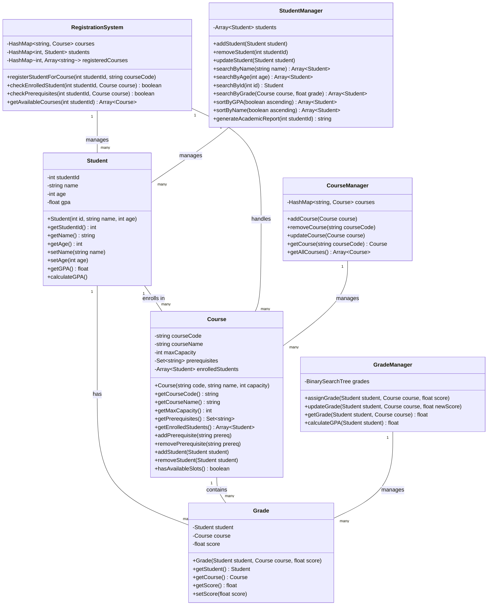

```mermaid

classDiagram
    class Student {
        -int studentId
        -string name
        -int age
        -float gpa
        +Student(int id, string name, int age)
        +getStudentId() int
        +getName() string
        +getAge() int
        +setName(string name)
        +setAge(int age)
        +getGPA() float
        +calculateGPA()
    }

    class Course {
        -string courseCode
        -string courseName
        -int maxCapacity
        -Set~string~ prerequisites
        -Array~Student~ enrolledStudents
        +Course(string code, string name, int capacity)
        +getCourseCode() string
        +getCourseName() string
        +getMaxCapacity() int
        +getPrerequisites() Set~string~
        +getEnrolledStudents() Array~Student~
        +addPrerequisite(string prereq)
        +removePrerequisite(string prereq)
        +addStudent(Student student)
        +removeStudent(Student student)
        +hasAvailableSlots() boolean
    }

    class Grade {
        -Student student
        -Course course
        -float score
        +Grade(Student student, Course course, float score)
        +getStudent() Student
        +getCourse() Course
        +getScore() float
        +setScore(float score)
    }

    class RegistrationSystem {
        -HashMap~string, Course~ courses
        -HashMap~int, Student~ students
        -HashMap~int, Array~string~~ registeredCourses
        +registerStudentForCourse(int studentId, string courseCode)
        +checkEnrolledStudent(int studentId, Course course) boolean
        +checkPrerequisites(int studentId, Course course) boolean
        +getAvailableCourses(int studentId) Array~Course~
    }

    class StudentManager {
        -Array~Student~ students
        +addStudent(Student student)
        +removeStudent(int studentId)
        +updateStudent(Student student)
        +searchByName(string name) Array~Student~
        +searchByAge(int age) Array~Student~
        +searchById(int id) Student
        +searchByGrade(Course course, float grade) Array~Student~
        +sortByGPA(boolean ascending) Array~Student~
        +sortByName(boolean ascending) Array~Student~
        +generateAcademicReport(int studentId) string
    }

    class CourseManager {
        -HashMap~string, Course~ courses
        +addCourse(Course course)
        +removeCourse(string courseCode)
        +updateCourse(Course course)
        +getCourse(string courseCode) Course
        +getAllCourses() Array~Course~
    }

    class GradeManager {
        -BinarySearchTree grades
        +assignGrade(Student student, Course course, float score)
        +updateGrade(Student student, Course course, float newScore)
        +getGrade(Student student, Course course) float
        +calculateGPA(Student student) float
    }

    Student "1" -- "many" Course : enrolls in
    Student "1" -- "many" Grade : has
    Course "1" -- "many" Grade : contains
    RegistrationSystem "1" -- "many" Student : manages
    RegistrationSystem "1" -- "many" Course : handles
    StudentManager "1" -- "many" Student : manages
    CourseManager "1" -- "many" Course : manages
    GradeManager "1" -- "many" Grade : manages
```
